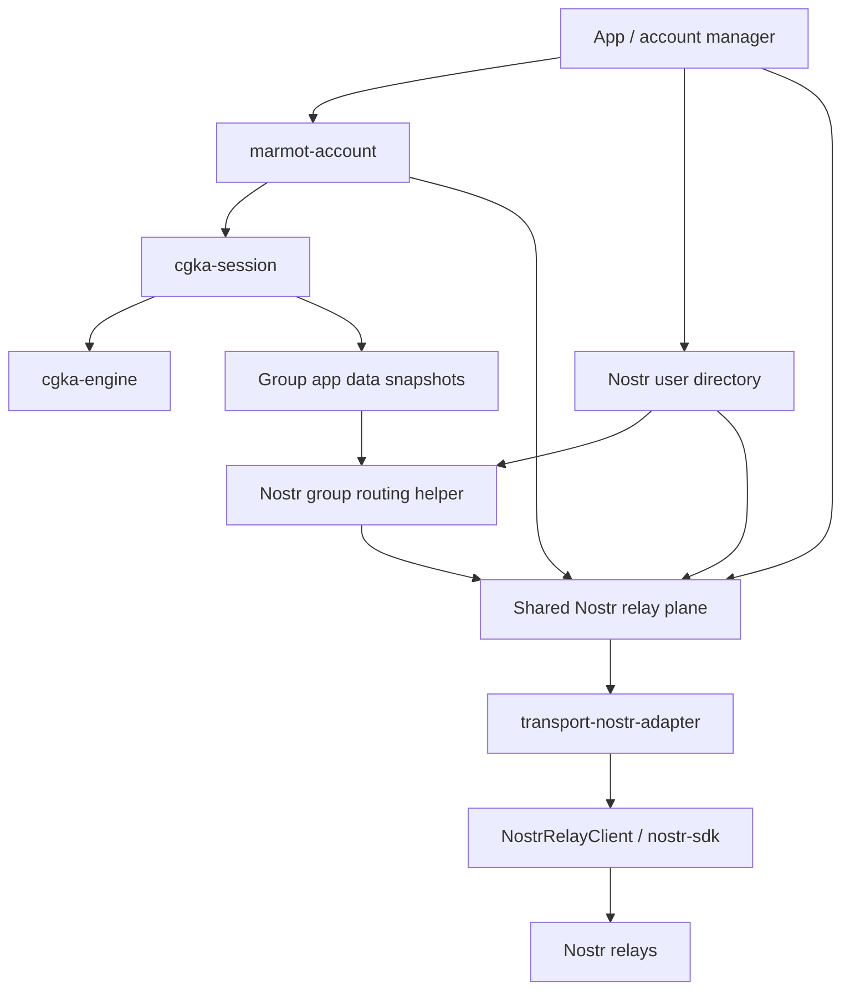

# Nostr Account Transport Notes

This note captures the current account-transport shape without turning this repository into the whole Nostr app core.

The near-term priority remains the CGKA engine: clean engine boundaries, strong chaos coverage, and portable vectors.
Nostr account transport work should support that goal by making the eventual whitenoise-rs integration clearer.

## Three Nostr Roles

Nostr has three separate roles in Marmot:

1. Identity. A Marmot user is identified by a Nostr pubkey. This is expected to stay fixed because it gives Marmot
   account identity, social discovery, and relay-discoverable user state.
2. Application message shape. The MLS-encrypted application payload uses an unsigned Nostr event shape.
3. Transport. Nostr relays are the first transport for MLS ciphertext, welcomes, KeyPackages, relay lists, and related
   account state.

The identity role is not expected to change. The transport role should remain replaceable.

## Account Transport Subsystems

The Nostr account transport layer should be split into four pieces.

### Nostr User Directory

The user directory is the warm local cache for Nostr identity data.

It should track:

- users keyed by Nostr pubkey;
- local accounts linked to those users;
- follow lists and follower-derived user records;
- mute lists and relay block decisions;
- profile metadata needed by the app;
- NIP-65 relay lists (also the outbox relays used for KeyPackage publication);
- inbox relay lists.

This is close to the shape whitenoise-rs already has: users and accounts are different records, with relationship and
relay data kept fresh in the background.

The MDK implementation keeps that scope bounded. It refreshes contact-list events for local signing accounts, caches
direct follows and profile metadata, and offers app surfaces both an offline search over cached follow edges and a
streaming search that traverses the live follow graph ranked by social distance. Live traversal stays bounded by
construction -- a capped radius, batched author-scoped fetches under a per-radius timeout, and a per-search lifecycle --
and never promotes a discovered stranger into the directory, so no discovery turns into a standing subscription. It does
not score the full Nostr social graph, and the CLI does not expose a separate user directory browsing command.

### Account Bootstrap

When creating or signing in to a Nostr-backed Marmot account, the app must ensure required account-published state
exists.

For the current Marmot design that includes:

- a NIP-65 relay list (kind `10002`), whose relays are also the outbox for KeyPackage publication;
- an inbox relay list for welcome gift wraps;
- enough local directory state to publish welcomes and KeyPackages correctly.

A missing NIP-65 relay list should be handled by account setup. It should not become a permanent runtime mystery for
KeyPackage publication.

### Shared Relay Plane

The relay plane owns relay connections and subscriptions across all local accounts.

It should:

- dedupe relay connections across accounts;
- dedupe compatible subscriptions where possible;
- keep account-aware delivery metadata;
- subscribe to each account's inbox relays for welcomes;
- subscribe to group relays for every active group on every account;
- publish group messages to group relays;
- publish KeyPackages to relays from the account's kind `10002` NIP-65 list;
- publish account relay-list events during bootstrap and updates.

Multi-account dedupe belongs here, below `marmot-account`. The account runtime should not need a global view of every
local account.

### Marmot Nostr Group Routing

Group message routing for Nostr-routed Marmot groups comes from signed MLS group state.

The source of truth is:

- `marmot.transport.nostr.routing.v1`

The routing helper should parse the current component state, validate update payloads, and project the component into:

- group subscriptions;
- group-message publish targets;
- relay-list update validation errors.

There should be no legacy group routing source for new work.

## Relay Safety Policy

Relay lists in the wild contain bad data. Local clients need a safety policy before connecting or publishing.

The policy should be explicit and testable:

- require valid relay URLs;
- require `wss://` for public relays; admit `ws://` only for loopback behind the explicit dev/test flag;
- reject malformed URLs;
- reject duplicate relay URLs after normalization rules are applied;
- cap relay counts;
- block known dead or abusive relays;
- track runtime relay health separately from signed group state.

Filtering runtime connections must not rewrite signed MLS group state. A client may decide not to connect to a relay
from a group component, but that decision is local policy.

Subscription admission is deliberately different from configuration and publish validation. A loaded inbox or signed
group route classifies each endpoint independently, preserves source order, admits at most sixteen safe distinct
endpoints, and records invalid, unsafe, retired, duplicate, and over-limit exclusions in local typed status. A route
with no admitted endpoint remains desired and policy-blocked; it never produces an empty SDK subscription. Strict
configuration setters and publish/quorum paths remain fail-closed.

The centralized retired-host list currently contains only `relay.nostr.band`. `relay.damus.io` is eligible under the
ordinary URL, TLS, host, and address-safety rules; this eligibility neither adds it to defaults nor rewrites published
or signed relay lists.

## Independent Registration and Replay Recovery

Desired inbox and group routes are installed locally before relay REQs are issued so immediate stored events remain
routable. Registration results are committed per route and, for the SDK client, per endpoint. A failure therefore
leaves unrelated routes live. Missing endpoint registrations retain their original subscription identity and replay
scope, and the account worker retries them through its single coalesced exponential scheduler (1, 2, 4, 8, 16, 32,
then 60 seconds), with at most eight route attempts and a five-second reconciliation budget per round.
Aggregate adapter telemetry distinguishes complete registration, degraded registration, zero-registration failure,
policy exclusions, and reconciliation retries. These are local operation counters: they do not imply remote event
acceptance, complete history, or recipient delivery, and they never carry account, route, relay, or endpoint labels.
Legacy lifecycle success continues to mean that the callable returned success; the registration breakdown is the
authoritative signal for successful-but-degraded coverage.

Every desired route is also represented by an account-private SQLCipher replay obligation before its subscription can
change or a newer account cursor can commit. Identity distinguishes inbox from group routes and, for groups, includes
the variable-length MLS group id, the 32-byte Nostr routing handle, current/historical role, and original normalized
endpoint scope. Repeated preparation keeps the earliest floor; an unfloored obligation dominates. Replacements
transfer unfinished floors before retiring superseded generations.

Registration alone never clears this durable work. The runtime freezes the obligation generations associated with a
full activation and clears only that frozen set after endpoint-complete EOSE and a durable delivery checkpoint. A
stale activation, route replacement, delivery-overflow marker, or missing endpoint coverage therefore leaves repair
incomplete. A crash after checkpointing but before clear can replay duplicates, but cannot skip the protected gap.

Rust and native bindings expose read-only account transport snapshots with separate inbox/current/historical routes,
typed admission and registration outcomes, pending replay, and coalescing process-local revisions. Reading or
subscribing to this status never starts an account worker or dials a relay.

## Boundary Sketch

`marmot-account` coordinates account-device work. It should stay transport-generic.

Nostr-specific directory state, relay-list publication, relay safety, and multi-account subscription dedupe belong in
the Nostr account transport layer.

## Near-Term Use

This note should guide the next interface design, but it should not expand the scope of this repository into a full
application core.

The next Nostr-facing code should be small:

- harden relay safety policy around `marmot.transport.nostr.routing.v1`;
- keep group subscriptions and publish targets projected from signed routing state;
- define how a Nostr-backed service publishes kind `30443` KeyPackages using the account's kind `10002` NIP-65
  relay-list data.

The engine work remains the center of gravity.
